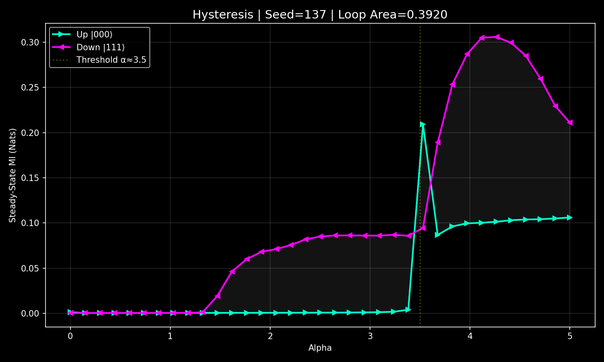
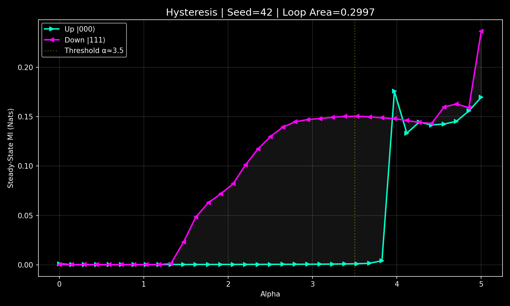
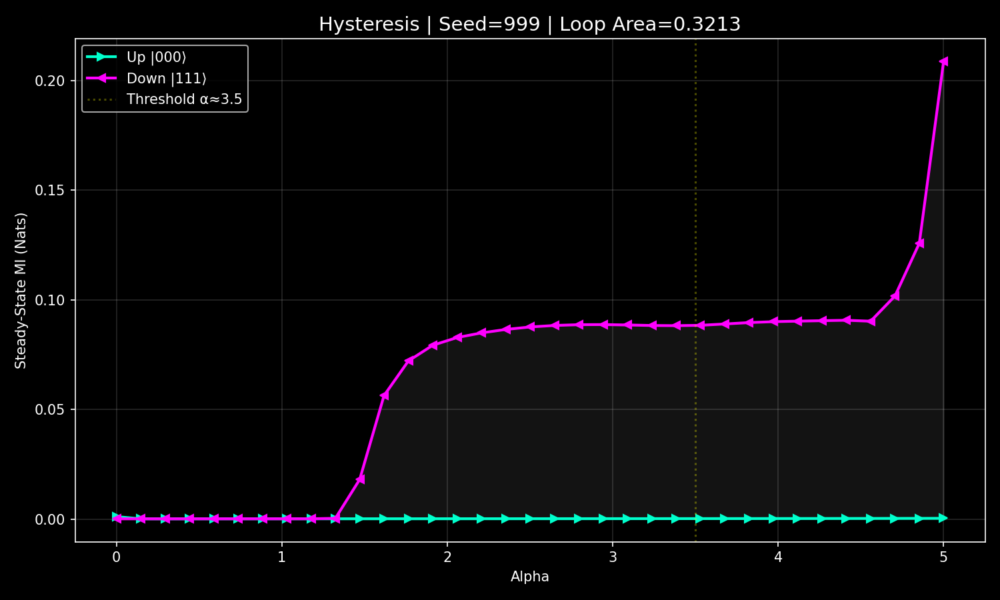
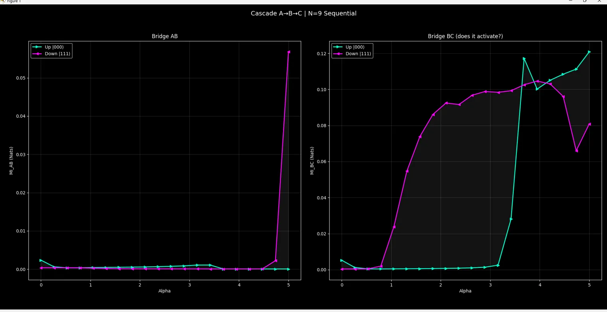
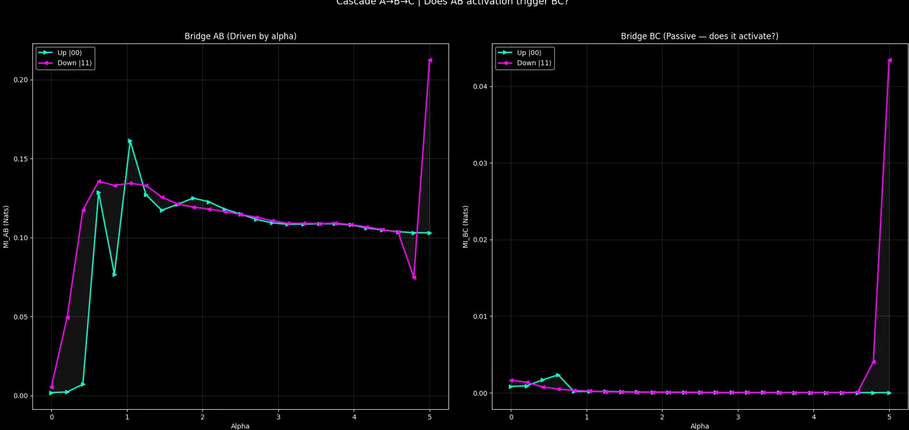

# Quantum MI Feedback: Bistability, Hysteresis & Cascade Suppression

**Author:** NemoGR
**Method:** Numerical simulation (Python/QuTiP, Lindblad master equation)  
**Status:** Amateur research, open for collaboration and critique

---

## What This Is

An open quantum spin system where bridge coupling strength is controlled in real time by mutual information (MI) via nonlinear feedback:

    g_eff = g0 + α · tanh(β · m)

where `m` is exponential memory of MI between subsystems.  
Decoherence modeled via Lindblad operators (QuTiP mesolve).

---

## Results

### 1. Hysteresis — 3 Independent Seeds

Same model, three different random bridge configurations.  
Loop area 0.30–0.39 nats in all cases.





---

### 2. Relaxation After Strike

After a decoherence strike, the high-MI (memory) state requires stronger feedback to recover than the cold-start state. Recovery threshold: α ≈ 2.3 (memory) vs α ≈ 1.8 (cold).


---

### 3. Cascade A→B→C — Suppression Effect

Three chains (9 qubits). Both AB and BC bridges active.  
Finding: MI_AB ≈ 0 throughout. MI_BC shows hysteresis independently.  
A acts as competing information sink suppressing BC correlations.



---

### 4. BC Without A — 4x Increase

Removing A entirely: MI_BC jumps from 0.10 to 0.42 nats.  
B and C form autonomous self-sustaining system.  
A is a parasite — its presence hurts BC correlations.



---

## Key Parameters

| Parameter | Value | Meaning |
|-----------|-------|---------|
| N_sub | 3 | Qubits per chain |
| β | 5.0 | Feedback steepness |
| g0 | 0.02 | Base coupling |
| γ | 0.7 | Z2 symmetry breaking |
| decoherence | 0.04 | Amplitude damping |
| dt | 1.0 | Time step |
| steps/point | 30 | Thermalization steps |

---

## Requirements
```bash
pip install qutip numpy matplotlib
```

---

## Files

| File | Description |
|------|-------------|
| `hysteresis.py` | Main hysteresis scan (3 seeds) |
| `cascade_ABC.py` | Three-chain cascade experiment |

---

## Open Questions

1. Is the bistability a genuine dissipative phase transition or crossover?
2. Does cascade suppression differ qualitatively from passive ancilla-induced disentangling?
3. Does the effect survive at N_sub = 4?
4. Why does A suppress BC rather than enhance it?

---

## Contact

Open to feedback from physicists.  
If you know related literature — please open an Issue.
